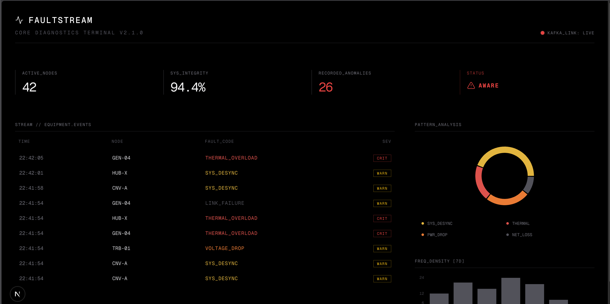

<div align="center">

```
███████╗ █████╗ ██╗   ██╗██╗  ████████╗███████╗████████╗██████╗ ███████╗ █████╗ ███╗   ███╗
██╔════╝██╔══██╗██║   ██║██║  ╚══██╔══╝██╔════╝╚══██╔══╝██╔══██╗██╔════╝██╔══██╗████╗ ████║
█████╗  ███████║██║   ██║██║     ██║   ███████╗   ██║   ██╔══██╗█████╗  ███████║██╔████╔██║
██╔══╝  ██╔══██║██║   ██║██║     ██║   ╚════██║   ██║   ██╔══██╗██╔══╝  ██╔══██║██║╚██╔╝██║
██║     ██║  ██║╚██████╔╝███████╗██║   ███████║   ██║   ██║  ██║███████╗██║  ██║██║ ╚═╝ ██║
╚═╝     ╚═╝  ╚═╝ ╚═════╝ ╚══════╝╚═╝   ╚══════╝   ╚═╝   ╚═╝  ╚═╝╚══════╝╚═╝  ╚═╝╚═╝     ╚═╝
```

**Industrial IoT Monitoring & Autonomous Fault Detection Platform**

*Real-time sensor streaming · Autonomous alert management · AI-powered diagnostics*

---

[](https://openjdk.org/)
[](https://spring.io/projects/spring-boot)
[](https://nextjs.org/)
[](https://kafka.apache.org/)
[](https://www.postgresql.org/)
[](https://redis.io/)
[](https://docs.docker.com/compose/)
[](LICENSE)
[]()
[]()

</div>

---

## Overview

FaultStream is an **enterprise-grade Industrial IoT platform** developed for real-time equipment monitoring, autonomous fault detection, and predictive maintenance. Built on a modern event-driven architecture, the system processes high-frequency sensor data via Apache Kafka, applies intelligent threshold rules, and automatically assigns work orders to technicians without human intervention.

The platform targets manufacturing plants, OEM operators, and infrastructure managers who want to transition from reactive maintenance to a **fully autonomous, data-driven operational model**.

> **Design philosophy:** FaultStream is a stream-first system. Every sensor reading, alert event, and state change flows through Kafka. This ensures horizontal scalability, fault tolerance, and a full audit trail from raw data to resolution.

---

## Live Demo

> Core Diagnostics Terminal — real-time equipment event stream, pattern analysis, and anomaly density tracking.



Inspired by NOC design, the dark interface provides operational awareness at a glance:

| Field | Description |
|---|---|
| **ACTIVE_NODES** | Number of active equipment connected to the stream |
| **SYS_INTEGRITY** | Total health score across all monitored assets |
| **RECORDED_ANOMALIES** | Total fault events in the active monitoring window |
| **STATUS** | System-wide threat level — NOMINAL / AWARE / CRITICAL |
| **STREAM // EQUIPMENT.EVENTS** | Live fault event stream originating from Kafka, with severity classification |
| **PATTERN_ANALYSIS** | Fault type distribution — THERMAL, SYS_DESYNC, PWR_DROP, NET_LOSS |
| **FREQ_DENSITY [7D]** | 7-day anomaly frequency histogram |

---

## System Environment

> Development and staging environment — Ubuntu 24.04, Intel i5-11300H, 15.3 GiB RAM, 467G NVMe storage.


The platform is optimized to run the full stack (PostgreSQL + Kafka + Zookeeper + Redis + Spring Boot + Next.js) on a single developer workstation. Production environment deployment is targeted on Kubernetes with separate pods per service.

---

## Architecture

```
+---------------------------------------------------------------------------+
|                         FAULTSTREAM PLATFORM                              |
|                                                                           |
|  +---------------+    +--------------------------------------------+     |
|  |  Next.js 14   |    |             Spring Boot 3.x                |     |
|  |   Dashboard   |<---|                                            |     |
|  |   (SSE/REST)  |    |  +----------+  +----------+  +----------+  |     |
|  +---------------+    |  |   Auth   |  |  Sensor  |  |  Alert   |  |     |
|                       |  |  Domain  |  |  Domain  |  |  Domain  |  |     |
|                       |  +----------+  +----+-----+  +----+-----+  |     |
|                       |                    |              |         |     |
|                       |         +----------+--------------+------+  |     |
|                       |         |        Apache Kafka 3.x         |  |     |
|                       |         |      topic: sensor-readings     |  |     |
|                       |         +------------------+--------------+  |     |
|                       |                            |                |     |
|                       |         +------------------v------------+   |     |
|                       |         |       SensorDataConsumer      |   |     |
|                       |         |    + ThresholdEvaluator       |   |     |
|                       |         |    + AlertEngine              |   |     |
|                       |         +------------------+------------+   |     |
|                       +--------------------------------------------+     |
|                                                   |                       |
|  +-----------+    +---------------+    +----------v----------------+      |
|  |   Redis   |    |  PostgreSQL   |    | Work Order Auto Assign    |      |
|  |   Cache   |    |   + Flyway    |    +---------------------------+      |
|  +-----------+    +---------------+                                       |
+---------------------------------------------------------------------------+
```

### Data Flow

```
Sensor Hardware / Simulator
          |
          v  (Kafka Producer)
   [sensor-readings topic]
          |
          v  (Kafka Consumer)
   ThresholdEvaluator
          |
     +----+----+
     |         |
  WARNING   CRITICAL
     |         |
   Create  Create Alert +
   Alert   Auto Assign to Tech
     |         |
     +----+----+
          |
          v
   Redis Cache  (instant read)
          |
          v
   Dashboard API (SSE)
          |
          v
   Next.js UI
```

---

## Technology Stack

| Layer | Technology | Purpose |
|---|---|---|
| **Backend** | Spring Boot 3.x / Java 21 | REST API, domain services, Kafka producer/consumer |
| **Security** | Spring Security + JWT | Role-based access control (ADMIN / ENGINEER / TECHNICIAN) |
| **Messaging** | Apache Kafka 3.x | High-volume sensor data streaming |
| **Database** | PostgreSQL 16 | Persistent storage of all domain entities |
| **Migration** | Flyway | Version-controlled schema evolution |
| **Cache** | Redis 7.x | Alert state, dashboard aggregations (~80% DB load reduction) |
| **Frontend** | Next.js 14 (App Router) | Real-time operations panel |
| **Charts** | Recharts | Time series and distribution visualizations |
| **Icons** | Lucide React | UI iconography |
| **Testing** | Mockito / MockMvc / Testcontainers | Unit and end-to-end integration tests |
| **Infrastructure**| Docker Compose | Full local stack orchestration |
| **Observability** | *(v6.0)* Prometheus + Grafana | Metric monitoring and visualization |
| **AI** | *(v6.0)* Spring AI + OpenAI API | Predictive fault diagnosis |

---

## Domain Model

```
User
 +-- Role: ADMIN / ENGINEER / TECHNICIAN
 +-- JWT authentication

Equipment
 +-- name, type, location, status
 +-- one-to-many ---> Sensors

Sensor
 +-- name, type (TEMPERATURE / VIBRATION / HUMIDITY / PRESSURE)
 +-- unit, location
 +-- produces ---> SensorReadings (via Kafka)

SensorReading
 +-- value, timestamp, status
 +-- evaluated by ---> ThresholdEvaluator

Alert
 +-- level: WARNING / CRITICAL
 +-- trigger time, resolution time
 +-- can create ---> WorkOrder (auto on CRITICAL)

WorkOrder
 +-- assigned technician, status, due date
 +-- upon completion ---> MaintenanceLog (v5.0+)

MaintenanceLog  --  v5.0+
 +-- action, duration, parts, cost
 +-- feeds ---> AI Diagnosis Service (v6.0+)
```

---

## Getting Started

### Prerequisites

- Java 21+
- Node.js 20+
- Docker & Docker Compose
- Maven 3.9+

### Clone & Run

```bash
# Clone the repository
git clone https://github.com/your-username/faultstream.git
cd faultstream

# Start infrastructure services
docker compose up -d

# Verify all services are healthy
docker compose ps
```

Expected services: `postgres`, `kafka`, `zookeeper`, `redis` — all should be in `healthy` status.

### Backend

```bash
cd faultstream-backend
./mvnw clean install
./mvnw spring-boot:run
```

API base URL: `http://localhost:8080/api/v1`

### Frontend

```bash
cd faultstream-dashboard
npm install
npm run dev
```

Dashboard URL: `http://localhost:3000`

---

## API Reference

### Authentication

```http
POST /api/v1/auth/register
POST /api/v1/auth/login
```

All subsequent requests require the `Authorization: Bearer <token>` header.

### Equipment

```http
GET    /api/v1/equipment
POST   /api/v1/equipment
GET    /api/v1/equipment/{id}
PUT    /api/v1/equipment/{id}
DELETE /api/v1/equipment/{id}
```

### Sensors *(v3.0+)*

```http
GET  /api/v1/sensors
GET  /api/v1/sensors/{id}
GET  /api/v1/sensors/{id}/readings?last=100
GET  /api/v1/sensors/{id}/readings?from=2025-01-01&to=2025-01-31
```

### Alerts *(v4.0+)*

```http
GET  /api/v1/alerts
GET  /api/v1/alerts/active
GET  /api/v1/alerts/{id}
POST /api/v1/alerts/{id}/resolve
POST /api/v1/alerts/{id}/snooze?minutes=30
```

### Work Orders *(v4.0+)*

```http
GET  /api/v1/work-orders
GET  /api/v1/work-orders/{id}
PUT  /api/v1/work-orders/{id}/assign
PUT  /api/v1/work-orders/{id}/complete
```

### Dashboard *(v5.0+)*

```http
GET  /api/v1/dashboard/summary
GET  /api/v1/dashboard/sensor-stream     <-- SSE endpoint (live stream)
GET  /api/v1/dashboard/alerts/recent
GET  /api/v1/dashboard/equipment/health
```

### AI Diagnosis *(v6.0+)*

```http
GET  /api/v1/ai/diagnosis/{equipmentId}
GET  /api/v1/ai/summary/daily
```

---

## Environment Variables

Create an `.env` file in the project root directory:

```env
# Database
POSTGRES_DB=faultstream
POSTGRES_USER=faultstream_user
POSTGRES_PASSWORD=your_secure_password

# Kafka
KAFKA_BOOTSTRAP_SERVERS=localhost:9092
KAFKA_TOPIC_SENSOR_READINGS=sensor-readings

# Redis
REDIS_HOST=localhost
REDIS_PORT=6379

# JWT
JWT_SECRET=your_256_bit_secret_key
JWT_EXPIRATION_MS=86400000

# Sensor Simulator
SIMULATOR_ENABLED=true
SIMULATOR_INTERVAL_MS=4000

# OpenAI (v6.0+)
OPENAI_API_KEY=sk-...
```

---

## Docker Compose Services

```bash
# Start all
docker compose up -d

# Stop all
docker compose down -v

# Infrastructure only (DB + Kafka + Redis)
docker compose up -d postgres kafka zookeeper redis
```

| Service | Port | Description |
|---|---|---|
| postgres | 5432 | PostgreSQL 16 |
| kafka | 9092 | Apache Kafka 3.x |
| zookeeper | 2181 | Kafka dependency |
| redis | 6379 | Redis 7.x |

---

## Project Structure

```
faultstream/
+-- faultstream-backend/
|   +-- src/main/java/com/faultstream/
|   |   +-- auth/              # JWT, Spring Security, User domain
|   |   +-- equipment/         # Equipment entity, service, controller
|   |   +-- sensor/            # Sensor domain (v3.0+)
|   |   |   +-- entity/
|   |   |   +-- kafka/         # Producer & Consumer
|   |   |   +-- scheduler/     # SensorSimulatorScheduler
|   |   |   +-- service/
|   |   +-- alert/             # Alert + ThresholdEvaluator (v4.0+)
|   |   +-- workorder/         # Work order auto assign (v4.0+)
|   |   +-- maintenance/       # MaintenanceLog (v5.0+)
|   |   +-- dashboard/         # DashboardController + SSE (v5.0+)
|   |   +-- ai/                # Spring AI Diagnosis Service (v6.0+)
|   |   +-- common/            # Shared helpers, exceptions
|   +-- src/main/resources/
|   |   +-- db/migration/      # Flyway SQL scripts (V1-V7)
|   |   +-- application.yml
|   +-- src/test/              # Mockito + Testcontainers
|
+-- faultstream-dashboard/     # Next.js 14 App Router
|   +-- app/
|   |   +-- dashboard/         # Main dashboard page
|   |   +-- equipment/         # Equipment list and details
|   |   +-- alerts/            # Alert management (v4.0+)
|   |   +-- maintenance/       # Maintenance log view (v5.0+)
|   +-- components/
|   |   +-- ui/                # Reusable UI components
|   |   +-- charts/            # Recharts wrappers
|   |   +-- stream/            # SSE hooks and live data (v5.0+)
|   +-- lib/
|       +-- api/               # Typed API client
|
+-- docker-compose.yml
+-- docs/
|   +-- screenshots/
+-- README.md
```

---

## Release Roadmap

| Version | Milestone | Status |
|---|---|---|
| **v1.0.0** | Docker infrastructure · Spring Security + JWT · User & Equipment domain | ✅ Completed |
| **v2.0.0** | Clean code transition · Next.js App Router · NOC dark dashboard · Mock real-time charts | ✅ Completed |
| **v3.0.0** | Sensor domain · Flyway V3/V4 · Kafka producer/consumer · SensorSimulatorScheduler | Completed |
| **v4.0.0** | Alert & Work Order domain · Threshold evaluation · Auto assignment · Redis cache | ✅ Completed |
| **v5.0.0** | Maintenance Log · DashboardController · SSE live integration · Testcontainers | Planned |
| **v6.0.0** | Spring Actuator · Prometheus · Grafana · Spring AI predictive diagnosis | Planned |
| **v7.0.0** | OT Edge Integration · Vendor Independence · Predictive Maintenance & Die Registry | Conceptual Phase |

### Future Phases Detailed Objectives

The following list summarizes the forward-looking critical stages in the `ROADMAP.md` document:

#### v3.0.0 — Sensor Data & Event Streaming

- Establishing the `Sensor` and `SensorReading` Domain infrastructure.
- Streaming random data to Kafka with `SensorSimulatorScheduler`.
- Parsing streaming data with `SensorDataConsumer`.

#### v4.0.0 — Autonomous Alerting & Work Orders

- Autonomous `Alert` generation when an anomaly is detected in the sensor stream.
- Assigning a `WorkOrder` without human intervention in case of critical alerts.
- Caching active alerts with `Redis` for performance.

#### v5.0.0 — Maintenance Tracking & Full API Integration

- Keeping the log history of every work order with `MaintenanceLog`.
- True Live Stream integration to the Next.js Dashboard using `DashboardController` instead of mock data.
- Canceling H2 database tests and building an e2e (end-to-end) testing structure over `Testcontainers` (Real PostgreSQL container).

#### v6.0.0 — Observability & Artificial Intelligence

- Installing Spring Boot Actuator, Micrometer, and Prometheus monitoring tools.
- Visualization for JVM usage, Kafka throughput, and CPU monitoring with `Grafana`.
- Writing a `DiagnosisService` (Smart Diagnosis) where AI will present "Potential Fault Prediction" by analyzing maintenance logs via connection to the OpenAI infrastructure.

#### v7.0.0 — OT Edge Integration & Predictive Tooling

- **Vendor Independent IoT Network:** Integrating physical field (OT) MQTT/OPC UA communication with Siemens IoT2050 (Edge Gateway) hardware to combine Schuler, AIDA, or legacy presses on a single screen.
- **Smart Workflows (Fault Stream Routing):** Instead of just generating alerts, adding real-time Push notifications (NFC verified task completion) and MTTR (Mean Time To Resolution) metrics to the technician's mobile app.
- **Predictive Trend Analysis:** Analyzing sensor streams (e.g., slow but trending increase in right pillar tonnage) and applying "Condition-Based Monitoring" machine learning models before hardware/die breaks.
- **Die and Equipment Digital Registry (Digital Twin):** Registering tools (Die ID) attached to the equipment, measuring and analyzing the lifespan each die spends on different machines and the fault scores it generates.

---

## Autonomous Alert Logic (v4.0+)

```
SensorReading arrives via Kafka
              |
              v
      ThresholdEvaluator
  +-------------------------------------------------------+
  |  value > rule.criticalThreshold?  --> YES             |
  |      --> Create CRITICAL Alert                        |
  |      --> Auto assign Work Order                       |
  |                                                       |
  |  value > rule.warningThreshold?   --> YES             |
  |      --> Create WARNING Alert                         |
  |      --> Await engineer review                        |
  |                                                       |
  |  value normal --> Update sensor health status         |
  +-------------------------------------------------------+
              |
              v  (If CRITICAL)
  WorkOrderService.autoAssign()
  +-- Find on-shift technician
  +-- Assign work order
  +-- Send SMS / Email notification (v4.x)
  +-- Start SLA countdown
```

Threshold rules are stored per sensor in the database and can be changed at runtime — no redeployment required.

---

## Performance Targets

| Metric | Target | Mechanism |
|---|---|---|
| Sensor ingest volume | 10,000+ readings/min | Kafka partitioning |
| Alert generation latency | < 500ms (from reading) | Consumer + Redis write |
| Dashboard API p95 latency | < 50ms | Redis cache hit |
| Database load reduction | ~80% | Redis for hot paths |
| Kafka consumer lag | < 5 seconds | Partition rebalancing |

---

## Testing Strategy

```bash
# Unit tests (Mockito + MockMvc)
./mvnw test

# Integration tests with Docker containers (v5.0+)
./mvnw verify -P integration-tests

# Specific domain test
./mvnw test -Dtest=EquipmentServiceTest
```

Test pyramid:

- **Unit tests** — Service layer with Mockito mocks
- **Controller tests** — MockMvc slice tests for REST endpoints
- **Integration tests** — Testcontainers with real PostgreSQL + Kafka

---

## Security

- JWT tokens with configurable expiration time
- Role-based access control: `ADMIN` > `ENGINEER` > `TECHNICIAN`
- Endpoint-level `@PreAuthorize` annotations
- Passwords encrypted with BCrypt (strength: 12)
- SQL injection protection via JPA parameterized queries
- CORS configured for dashboard origin only

---

## Field Hardware (OT) and Sensor Architecture

FaultStream is not just a software platform, but also an end-to-end Industry 4.0 solution that collects data from the physical world (especially heavy industrial machinery like eccentric/mechanical presses). The data simulated in the development environment is collected with the following hardware architecture in the actual production field:

### 1. Sensor Types and Locations (Mechanical Press Example)

The industry-standard sensor groups to be retrofitted to the machines are as follows:

- **Strain Gauge (Tonnage Sensor):**
  - **What it captures:** Measures the crushing/striking force (Tonnage) applied by the press.
  - **Where it's attached:** Welded or fixed with special screws to the surface of the press's main pillars or connecting rods. Usually, 1 is attached to each of the 4 pillars to detect unbalanced loads.
  - **Function:** Captures "Over Tonnage" errors caused by double part loading in the die, jamming, or incorrect material feeding. With the help of an Amplifier in the panel, it converts the strain at the millivolt (mV) level to the 0-10V / 4-20mA range for the PLC.
- **Rotary Encoder or Inductive Cam Sensor (Ram Position):**
  - **What it captures:** Reports the instantaneous position of the press ram between 0-360 degrees.
  - **Where it's attached:** Connected to the rotating eccentric shaft (crankshaft hub) of the press.
  - **Function:** Reading tonnage alone is not enough; it works in sync with tonnage sensors to verify that maximum tonnage occurs when the ram fully strikes the sheet metal (180° - Bottom dead center).
- **Part Ejection Sensor:**
  - **What it captures:** Checks whether the pressed part has left the die.
  - **Where it's attached:** Attached to the die exit or above the discharge belt (Laser or Fiber optic).
  - **Function:** If the part does not drop and remains inside, it locks the system. It is the number one prevention system for die breakages.

### 2. Electrical Panel Connections and Data Security

Cables from these sensors are not drawn all the way to office areas. To prevent heavy vibration, metal dust, and electromagnetic interference, the entire system is collected in the **machine's main electrical control panel (or the adjacent IP65 insulated armored IoT panel)**.

1. **Power Requirement:** Our Edge devices are not like home or office computers, they operate on 24V DC and we draw power from the panel.
2. **Analog Data Quality (Noise Filtering):** To prevent analog signals coming from sensors from hitting the magnetic field of motor drivers (inverters) in long cables and getting corrupted (Noise), cables are kept very short and transferred to the entry-level PLC or Tonnage Monitor Module in the panel.

### 3. Sending Data to the Cloud (Edge Computing Method)

To ensure cybersecurity between the field and the FaultStream backend and to prevent unnecessary data load, no direct connection is made.

- **Edge Gateway:** A DIN-rail industrial device (e.g., Siemens IoT2050 or Raspberry Pi IPC) is installed inside the panel. This device extracts data by directly connecting to the PLC with its 1st Ethernet port, and talks to the outside world by connecting to the factory internet with its 2nd Port.
- **Data Filtering:** Instead of sending 10,000 data points per second and exhausting the bandwidth, it processes the data by saying "Send only the Peak Tonnage" or "Send only when there is an ERROR" from the sensor.
- **Offline Data Protection:** When the internet drops in the factory, the Gateway device accumulates the error history it reads from the sensor in its small local database or on RAM (e.g., SQLite / Redis) (Buffer). The moment the network connection is re-established, it transmits the entire package to the FaultStream servers.

### 4. Field Hardware Cost Analysis (BOM - Bill of Materials)

The actual market costs (Current Turkish Pricing - in TRY) of the hardware required to make a machine (e.g., a 1990 model old-type mechanical press) Industry 4.0 compliant and connect it to FaultStream:

> **Note:** If the machine already has a new generation PLC (Siemens S7-1200/1500, Beckhoff, etc.), items A, B, and D are not needed. Only the Gateway (C) is added, or data can be extracted directly with OPC UA at **zero hardware cost**.

| Category | Industrial Hardware (Example Brand/Model) | Estimated Unit Cost (TRY) |
| :--- | :--- | :--- |
| **A. Sensor Cluster** | 4-piece Strain Gauge (Wintriss/Kistler/Toledo equivalents), 1x SICK/Pepperl+Fuchs Encoder | 25,000 ₺ - 35,000 ₺ |
| **B. PLC (Brain)** | Siemens S7-1200 Series (CPU 1214C) + 4-Channel Analog Module (SM 1231) | 20,000 ₺ - 25,000 ₺ |
| **C. Edge Gateway**| Siemens SIMATIC IOT2050 (or RevPi Core) - Local data buffer and cloud bridge | 13,000 ₺ - 16,000 ₺ |
| **D. Panel & Infrastructure** | IP65 Industrial Electronic Panel, 24V Din Rail Power Supply, Switch, Mounting Cables | 8,000 ₺ - 12,000 ₺ |
| **TOTAL INVESTMENT** | **End-to-End Full Digitalization Cost of 1 Old Type Machine** | **~66,000 ₺ - 88,000 ₺** |

**Return on Investment (ROI):** This full package hardware investment worth an average of 75,000 TRY pays for itself at least 3-4 times the very first second it prevents a single **300,000 TRY damage and a 3-day planned/unplanned downtime (production loss)** caused by a die breakage.

---

## Contributing

```bash
# Fork and clone
git clone https://github.com/your-username/faultstream.git

# Create a feature branch
git checkout -b feature/sensor-mqtt-adapter

# Commit using Conventional Commits format
git commit -m "feat(sensor): Add MQTT protocol adapter"

# Push and open a PR
git push origin feature/sensor-mqtt-adapter
```

Branch naming conventions: `feature/`, `fix/`, `chore/`, `docs/`

Commit format: [Conventional Commits](https://www.conventionalcommits.org/)

---

## License

This project is licensed under the **MIT License** — see the [LICENSE](LICENSE) file for details.

---

<div align="center">

**FaultStream** — Built with Java, Kafka, and the belief that machines should report their own faults.

*Core Diagnostics Terminal · Industrial IoT · Event-Driven Architecture*

</div>
