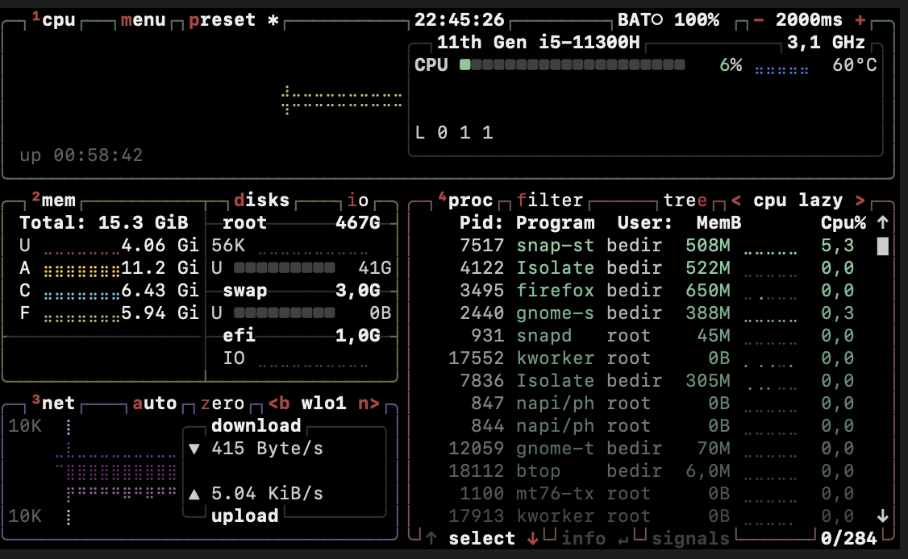

<div align="center">

```
███████╗ █████╗ ██╗   ██╗██╗  ████████╗███████╗████████╗██████╗ ███████╗ █████╗ ███╗   ███╗
██╔════╝██╔══██╗██║   ██║██║  ╚══██╔══╝██╔════╝╚══██╔══╝██╔══██╗██╔════╝██╔══██╗████╗ ████║
█████╗  ███████║██║   ██║██║     ██║   ███████╗   ██║   ██████╔╝█████╗  ███████║██╔████╔██║
██╔══╝  ██╔══██║██║   ██║██║     ██║   ╚════██║   ██║   ██╔══██╗██╔══╝  ██╔══██║██║╚██╔╝██║
██║     ██║  ██║╚██████╔╝███████╗██║   ███████║   ██║   ██║  ██║███████╗██║  ██║██║ ╚═╝ ██║
╚═╝     ╚═╝  ╚═╝ ╚═════╝ ╚══════╝╚═╝   ╚══════╝   ╚═╝   ╚═╝  ╚═╝╚══════╝╚═╝  ╚═╝╚═╝     ╚═╝
```

**Endüstriyel IoT İzleme & Otonom Arıza Tespit Platformu**

*Gerçek zamanlı sensör akışı · Otonom alarm yönetimi · Yapay zeka destekli teşhis*

---

[](https://openjdk.org/)
[](https://spring.io/projects/spring-boot)
[](https://nextjs.org/)
[](https://kafka.apache.org/)
[](https://www.postgresql.org/)
[](https://redis.io/)
[](https://docs.docker.com/compose/)
[](LICENSE)
[]()
[]()

</div>

---

## Genel Bakis

FaultStream; gercek zamanli ekipman izleme, otonom ariza tespiti ve onleyici bakim icin gelistirilmis **kurumsal duzey bir Endustriyel IoT platformudur**. Modern event-driven (olay odakli) mimari uzerine insa edilen sistem, Apache Kafka araciligiyla yuksek frekansi sensor verilerini isler, akilli esik kurallari uygular ve insan mudahalesi olmaksizin teknisyenlere otomatik is emri atar.

Platform; reaktif bakimdan **tam otonom, veri odakli operasyon modeline** gecmek isteyen uretim tesisleri, OEM operatorler ve altyapi yoneticilerini hedeflemektedir.

> **Tasarim felsefesi:** FaultStream, akis-oncelikli (stream-first) bir sistemdir. Her sensor okumasi, alarm olayi ve durum degisikligi Kafka uzerinden akar. Bu sayede yatay olceklenebilirlik, hata toleransi ve ham veriden cozume uzanan tam denetim kaydi saglanir.

---

## Canli Demo

> Core Diagnostics Terminal — gercek zamanli ekipman olay akisi, oruntu analizi ve anomali yogunlugu takibi.


NOC tasarimindan ilham alan karanlik arayuz, tek bakista operasyonel farkindalik saglar:

| Alan | Aciklama |
|---|---|
| **ACTIVE_NODES** | Akisa bagli aktif ekipman sayisi |
| **SYS_INTEGRITY** | Tum izlenen varliklardaki toplam saglik skoru |
| **RECORDED_ANOMALIES** | Aktif izleme penceresindeki toplam ariza olayi |
| **STATUS** | Sistem geneli tehdit seviyesi — NOMINAL / AWARE / CRITICAL |
| **STREAM // EQUIPMENT.EVENTS** | Kafka kaynakli canli ariza olay akisi, onem siniflandirmasi ile |
| **PATTERN_ANALYSIS** | Ariza turu dagilimi — THERMAL, SYS_DESYNC, PWR_DROP, NET_LOSS |
| **FREQ_DENSITY [7D]** | 7 gunluk anomali frekansi histogrami |

---

## Sistem Ortami

> Gelistirme ve hazirlama ortami — Ubuntu 24.04, Intel i5-11300H, 15.3 GiB RAM, 467G NVMe depolama.



Platform, tam stack'i (PostgreSQL + Kafka + Zookeeper + Redis + Spring Boot + Next.js) tek bir gelistirici is istasyonunda calistiracak sekilde optimize edilmistir. Uretim ortami dagitimi, servis basina ayri pod'larla Kubernetes uzerinde hedeflenmektedir.

---

## Mimari

```
+---------------------------------------------------------------------------+
|                         FAULTSTREAM PLATFORM                              |
|                                                                           |
|  +---------------+    +--------------------------------------------+     |
|  |  Next.js 14   |    |             Spring Boot 3.x                |     |
|  |   Dashboard   |<---|                                            |     |
|  |   (SSE/REST)  |    |  +----------+  +----------+  +----------+  |     |
|  +---------------+    |  |   Auth   |  |  Sensor  |  |  Alert   |  |     |
|                       |  |  Domain  |  |  Domain  |  |  Domain  |  |     |
|                       |  +----------+  +----+-----+  +----+-----+  |     |
|                       |                    |              |         |     |
|                       |         +----------+--------------+------+  |     |
|                       |         |        Apache Kafka 3.x         |  |     |
|                       |         |      konu: sensor-readings      |  |     |
|                       |         +------------------+--------------+  |     |
|                       |                            |                |     |
|                       |         +------------------v------------+   |     |
|                       |         |       SensorDataConsumer      |   |     |
|                       |         |    + EsikDegerlendirici       |   |     |
|                       |         |    + AlarmMotoru              |   |     |
|                       |         +------------------+------------+   |     |
|                       +--------------------------------------------+     |
|                                                   |                       |
|  +-----------+    +---------------+    +----------v----------------+      |
|  |   Redis   |    |  PostgreSQL   |    |  Is Emri Otomatik Atama  |      |
|  |  Onbellek |    |   + Flyway    |    +---------------------------+      |
|  +-----------+    +---------------+                                       |
+---------------------------------------------------------------------------+
```

### Veri Akisi

```
Sensor Donanimi / Simulatoru
          |
          v  (Kafka Producer)
   [sensor-readings topic]
          |
          v  (Kafka Consumer)
   EsikDegerlendirici
          |
     +----+----+
     |         |
  UYARI    KRITIK
     |         |
   Alarm    Alarm + Is Emri
  Olustur  Teknisyene Otomatik Ata
     |         |
     +----+----+
          |
          v
   Redis Onbellegi  (anlik okuma)
          |
          v
   Dashboard API (SSE)
          |
          v
   Next.js Arayuz
```

---

## Teknoloji Yigini

| Katman | Teknoloji | Amac |
|---|---|---|
| **Backend** | Spring Boot 3.x / Java 21 | REST API, domain servisleri, Kafka producer/consumer |
| **Guvenlik** | Spring Security + JWT | Rol tabanli erisim kontrolu (ADMIN / MUHENDIS / TEKNISYEN) |
| **Mesajlasma** | Apache Kafka 3.x | Yuksek hacimli sensor verisi akisi |
| **Veritabani** | PostgreSQL 16 | Tum domain entity'lerinin kalici depolanmasi |
| **Goc (Migration)** | Flyway | Versiyon kontrollu sema evrimi |
| **Onbellek** | Redis 7.x | Alarm durumu, dashboard agregasyonlari (%80 DB yuku azalmasi) |
| **Frontend** | Next.js 14 (App Router) | Gercek zamanli operasyon paneli |
| **Grafikler** | Recharts | Zaman serisi ve dagilim gorsellestirmeleri |
| **Ikonlar** | Lucide React | Arayuz ikonografisi |
| **Test** | Mockito / MockMvc / Testcontainers | Birim ve uctan uca entegrasyon testleri |
| **Altyapi** | Docker Compose | Tam yerel stack orkestrasyonu |
| **Gozlemlenebilirlik** | *(v6.0)* Prometheus + Grafana | Metrik izleme ve gorsellestirme |
| **Yapay Zeka** | *(v6.0)* Spring AI + OpenAI API | Tahminsel ariza tehsisi |

---

## Domain Modeli

```
Kullanici (User)
 +-- Rol: ADMIN / MUHENDIS / TEKNISYEN
 +-- JWT ile kimlik dogrulama

Ekipman (Equipment)
 +-- ad, tip, konum, durum
 +-- coka ---> Sensorler

Sensor (Sensor)
 +-- ad, tip (SICAKLIK / TITRESIM / NEM / BASINC)
 +-- birim, konum
 +-- uretir ---> SensorOkumalari  (Kafka uzerinden)

SensorOkumasi (SensorReading)
 +-- deger, zaman damgasi, durum
 +-- degerlendirilir ---> EsikDegerlendirici

Alarm (Alert)
 +-- seviye: UYARI / KRITIK
 +-- tetiklenme zamani, cozum zamani
 +-- olusturabilir ---> Is Emri  (KRITIK'te otomatik)

Is Emri (WorkOrder)
 +-- atanan teknisyen, durum, bitis tarihi
 +-- tamamlaninca ---> Bakim Kaydi  (v5.0+)

Bakim Kaydi (MaintenanceLog)  --  v5.0+
 +-- islem, sure, parcalar, maliyet
 +-- besler ---> Yapay Zeka Tehsis Servisi  (v6.0+)
```

---

## Baslangic

### Gereksinimler

- Java 21+
- Node.js 20+
- Docker & Docker Compose
- Maven 3.9+

### Klonla & Calistir

```bash
# Depoyu klonla
git clone https://github.com/kullanici-adin/faultstream.git
cd faultstream

# Altyapi servislerini basalt
docker compose up -d

# Tum servislerin saglikli oldugunu dogrula
docker compose ps
```

Beklenen servisler: `postgres`, `kafka`, `zookeeper`, `redis` — hepsi `healthy` durumunda olmali.

### Backend

```bash
cd faultstream-backend
./mvnw clean install
./mvnw spring-boot:run
```

API taban URL: `http://localhost:8080/api/v1`

### Frontend

```bash
cd faultstream-dashboard
npm install
npm run dev
```

Dashboard URL: `http://localhost:3000`

---

## API Referansi

### Kimlik Dogrulama

```http
POST /api/v1/auth/register
POST /api/v1/auth/login
```

Sonraki tum isteklerde `Authorization: Bearer <token>` basligi zorunludur.

### Ekipman

```http
GET    /api/v1/equipment
POST   /api/v1/equipment
GET    /api/v1/equipment/{id}
PUT    /api/v1/equipment/{id}
DELETE /api/v1/equipment/{id}
```

### Sensorler *(v3.0+)*

```http
GET  /api/v1/sensors
GET  /api/v1/sensors/{id}
GET  /api/v1/sensors/{id}/readings?last=100
GET  /api/v1/sensors/{id}/readings?from=2025-01-01&to=2025-01-31
```

### Alarmlar *(v4.0+)*

```http
GET  /api/v1/alerts
GET  /api/v1/alerts/active
GET  /api/v1/alerts/{id}
POST /api/v1/alerts/{id}/resolve
POST /api/v1/alerts/{id}/snooze?minutes=30
```

### Is Emirleri *(v4.0+)*

```http
GET  /api/v1/work-orders
GET  /api/v1/work-orders/{id}
PUT  /api/v1/work-orders/{id}/assign
PUT  /api/v1/work-orders/{id}/complete
```

### Dashboard *(v5.0+)*

```http
GET  /api/v1/dashboard/summary
GET  /api/v1/dashboard/sensor-stream     <-- SSE endpoint (canli akis)
GET  /api/v1/dashboard/alerts/recent
GET  /api/v1/dashboard/equipment/health
```

### Yapay Zeka Tehsisi *(v6.0+)*

```http
GET  /api/v1/ai/diagnosis/{equipmentId}
GET  /api/v1/ai/summary/daily
```

---

## Ortam Degiskenleri

Proje kok dizininde `.env` dosyasi olusturun:

```env
# Veritabani
POSTGRES_DB=faultstream
POSTGRES_USER=faultstream_user
POSTGRES_PASSWORD=guvenli_sifreniz

# Kafka
KAFKA_BOOTSTRAP_SERVERS=localhost:9092
KAFKA_TOPIC_SENSOR_READINGS=sensor-readings

# Redis
REDIS_HOST=localhost
REDIS_PORT=6379

# JWT
JWT_SECRET=256_bit_gizli_anahtariniz
JWT_EXPIRATION_MS=86400000

# Sensor Simulatoru
SIMULATOR_ENABLED=true
SIMULATOR_INTERVAL_MS=4000

# OpenAI (v6.0+)
OPENAI_API_KEY=sk-...
```

---

## Docker Compose Servisleri

```bash
# Tumunu basalt
docker compose up -d

# Tumunu durdur
docker compose down -v

# Sadece altyapi (DB + Kafka + Redis)
docker compose up -d postgres kafka zookeeper redis
```

| Servis | Port | Aciklama |
|---|---|---|
| postgres | 5432 | PostgreSQL 16 |
| kafka | 9092 | Apache Kafka 3.x |
| zookeeper | 2181 | Kafka bagimliligi |
| redis | 6379 | Redis 7.x |

---

## Proje Yapisi

```
faultstream/
+-- faultstream-backend/
|   +-- src/main/java/com/faultstream/
|   |   +-- auth/              # JWT, Spring Security, Kullanici domain
|   |   +-- equipment/         # Ekipman entity, servis, controller
|   |   +-- sensor/            # Sensor domain (v3.0+)
|   |   |   +-- entity/
|   |   |   +-- kafka/         # Producer & Consumer
|   |   |   +-- scheduler/     # SensorSimulatorScheduler
|   |   |   +-- service/
|   |   +-- alert/             # Alarm + EsikDegerlendirici (v4.0+)
|   |   +-- workorder/         # Is emri otomatik atama (v4.0+)
|   |   +-- maintenance/       # Bakim Kaydi (v5.0+)
|   |   +-- dashboard/         # DashboardController + SSE (v5.0+)
|   |   +-- ai/                # Spring AI Tehsis Servisi (v6.0+)
|   |   +-- common/            # Paylasilan yardimcilar, istisnalar
|   +-- src/main/resources/
|   |   +-- db/migration/      # Flyway SQL scriptleri (V1-V7)
|   |   +-- application.yml
|   +-- src/test/              # Mockito + Testcontainers
|
+-- faultstream-dashboard/     # Next.js 14 App Router
|   +-- app/
|   |   +-- dashboard/         # Ana dashboard sayfasi
|   |   +-- equipment/         # Ekipman listesi ve detay
|   |   +-- alerts/            # Alarm yonetimi (v4.0+)
|   |   +-- maintenance/       # Bakim kaydi gorunumu (v5.0+)
|   +-- components/
|   |   +-- ui/                # Yeniden kullanilabilir UI bilesenleri
|   |   +-- charts/            # Recharts sarmalayicilari
|   |   +-- stream/            # SSE hook'lari ve canli veri (v5.0+)
|   +-- lib/
|       +-- api/               # Tipli API istemcisi
|
+-- docker-compose.yml
+-- docs/
|   +-- screenshots/
+-- README.md
```

---

## Surum Yol Haritasi

| Surum | Kilometre Tasi | Durum |
|---|---|---|
| **v1.0.0** | Docker altyapisi · Spring Security + JWT · Kullanici & Ekipman domain | ✅ Tamamlandi |
| **v2.0.0** | Temiz kod gecisi · Next.js App Router · NOC karanlik dashboard · Mock gercek zamanli grafikler | ✅ Tamamlandi |
| **v3.0.0** | Sensor domain · Flyway V3/V4 · Kafka producer/consumer · SensorSimulatorScheduler | Devam Ediyor |
| **v4.0.0** | Alarm & Is Emri domain · Esik degerlendirme · Otomatik atama · Redis onbellek | Planlandi |
| **v5.0.0** | Bakim Kaydi · DashboardController · SSE canli entegrasyon · Testcontainers | Planlandi |
| **v6.0.0** | Spring Actuator · Prometheus · Grafana · Spring AI tahminsel tehsis | Planlandi |

---

## Otonom Alarm Mantigi (v4.0+)

```
Kafka uzerinden SensorOkumasi gelir
              |
              v
      EsikDegerlendirici
  +-------------------------------------------------------+
  |  deger > kural.kritikEsik?  --> EVET                  |
  |      --> KRITIK Alarm olustur                         |
  |      --> Is Emri otomatik ata                         |
  |                                                       |
  |  deger > kural.uyariEsik?   --> EVET                  |
  |      --> UYARI Alarm olustur                          |
  |      --> Muhendis incelemesi beklenir                 |
  |                                                       |
  |  deger normal --> Sensor saglik durumunu guncelle     |
  +-------------------------------------------------------+
              |
              v  (KRITIK ise)
  IsEmriServisi.otomatikAta()
  +-- Vardiyada olan teknisyeni bul
  +-- Is emrini ata
  +-- SMS / E-posta bildirimi gonder  (v4.x)
  +-- SLA geri sayimini basalt
```

Esik kurallari veritabaninda sensor basina saklanir ve calisma zamaninda degistirilebilir — yeniden dagitim gerekmez.

---

## Performans Hedefleri

| Metrik | Hedef | Mekanizma |
|---|---|---|
| Sensor alinan hacmi | 10.000+ okuma/dakika | Kafka bolümleme |
| Alarm uretme gecikmesi | < 500ms (okumadan itibaren) | Consumer + Redis yazma |
| Dashboard API p95 gecikmesi | < 50ms | Redis onbellek isabeti |
| Veritabani yuku azalmasi | ~%80 | Sicak yollar icin Redis |
| Kafka consumer gecikmesi | < 5 saniye | Bolum yeniden dengeleme |

---

## Test Stratejisi

```bash
# Birim testleri (Mockito + MockMvc)
./mvnw test

# Docker container'lariyla entegrasyon testleri (v5.0+)
./mvnw verify -P integration-tests

# Belirli bir domain testi
./mvnw test -Dtest=EquipmentServiceTest
```

Test piramidi:

- **Birim testleri** — Mockito mock'lariyla servis katmani
- **Controller testleri** — REST endpoint'leri icin MockMvc dilim testleri
- **Entegrasyon testleri** — Gercek PostgreSQL + Kafka ile Testcontainers

---

## Guvenlik

- Yapilandirilabilir sona erme sureli JWT token'lar
- Rol tabanli erisim kontrolu: `ADMIN` > `MUHENDIS` > `TEKNISYEN`
- Endpoint duzeyinde `@PreAuthorize` anotasyonlari
- BCrypt ile sifrelenmiş parolalar (guc: 12)
- JPA parametreli sorgu ile SQL enjeksiyonu koruması
- CORS yalnizca dashboard kaynagi icin yapilandirilmis

---

## Katkida Bulunma

```bash
# Fork'la ve klonla
git clone https://github.com/kullanici-adin/faultstream.git

# Ozellik dali olustur
git checkout -b feature/sensor-mqtt-adapter

# Conventional Commits formatiyla commit yap
git commit -m "feat(sensor): MQTT protokol adaptoru eklendi"

# Push et ve PR ac
git push origin feature/sensor-mqtt-adapter
```

Dal adlandirma kurallari: `feature/`, `fix/`, `chore/`, `docs/`

Commit formati: [Conventional Commits](https://www.conventionalcommits.org/)

---

## Lisans

Bu proje **MIT Lisansi** ile lisanslanmistir — ayrintilar icin [LICENSE](LICENSE) dosyasina bakin.

---

<div align="center">

**FaultStream** — Java, Kafka ve makinelerin kendi arizalarini raporlamasi gerektigi inanciyla insa edildi.

*Core Diagnostics Terminal · Endustriyel IoT · Olay Odakli Mimari*

</div>
