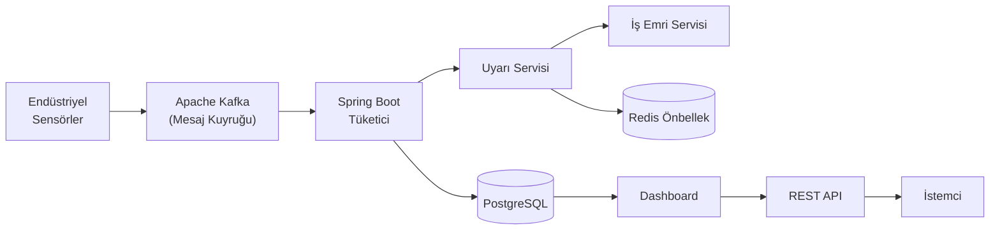
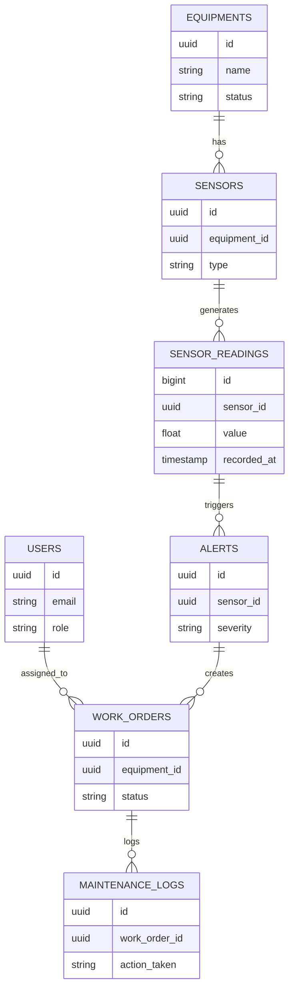

# FaultStream

**Endüstriyel Ekipman Arıza Tespit ve Yönetim Sistemi**

[](https://www.oracle.com/java/)
[](https://spring.io/projects/spring-boot)
[](https://kafka.apache.org/)
[](https://www.postgresql.org/)
[](https://redis.io/)
[](https://www.docker.com/)
[](LICENSE)

---

## Genel Bakış

**FaultStream**, orta ölçekli üretim tesislerindeki ekipmanları gerçek zamanlı olarak izleyen, anomalileri otomatik tespit eden ve bakım süreçlerini yöneten bir **olay tabanlı (event-driven) backend sistemidir.**

Birçok fabrika; ekipman arızalarını hâlâ Excel tabloları, kağıt formlar ve telefon görüşmeleriyle yönetmektedir. SAP PM veya IBM Maximo gibi kurumsal çözümler ise büyük şirketler için bile karmaşık ve maliyetlidir. FaultStream bu boşluğu, modern ve ölçeklenebilir bir mimariyle kapatmayı hedefler.

---

## Problem

Üretim ortamları sürekli sensör verisi üretir. Ancak:

- Arızalar çok geç fark edilir → üretim durur, para kaybedilir
- Bakım süreçleri manuel yürütülür → insan hatası kaçınılmazdır
- Merkezi bir takip sistemi yoktur → geçmişe dönük analiz yapılamaz
- Kurumsal araçlar aşırı pahalıdır → KOBİ'ler dışlanır

---

## Çözüm

FaultStream, sensör verisini gerçek zamanlı işler, eşik ihlallerini tespit eder ve bakım operasyonlarını otomatikleştirir.

**Temel Yetenekler:**

| Özellik | Açıklama |
|---|---|
| Gerçek Zamanlı Arıza Tespiti | Sensör verisi Kafka üzerinden anlık işlenir |
| Otomatik Uyarı Üretimi | Eşik aşımlarında sistem otomatik alert oluşturur |
| İş Emri Yönetimi | Kritik arızalar için iş emri otomatik açılır |
| Bakım Takibi | Tüm müdahaleler kayıt altına alınır |
| Ekipman Sağlık İzleme | Her ekipmanın anlık durumu takip edilir |

---

## Teknoloji Yığını

| Katman | Teknoloji | Amaç |
|---|---|---|
| Çalışma Ortamı | Java 21 | Loom desteği, modern concurrency yapısı |
| Framework | Spring Boot 3.5 | REST API, DI, güvenlik altyapısı |
| Veritabanı | PostgreSQL | İlişkisel veri tutarlılığı |
| Mesaj Kuyruğu | Apache Kafka | Yüksek hacimli sensör verisi akışı |
| Önbellekleme | Redis | Aktif uyarıların hızlı erişimi |
| Şema Yönetimi | Flyway | Veritabanı migrasyonlarının sürüm kontrolü |
| Güvenlik | Spring Security + JWT | Stateless kimlik doğrulama |
| Konteynerleştirme | Docker & Compose | Tek komutla ayağa kalkan ortam |
| CI/CD | GitHub Actions | Otomatik derleme ve test koşusu |
| API Dökümantasyonu | SpringDoc OpenAPI | Swagger UI entegrasyonu |

---

## Sistem Mimarisi

Aşağıdaki diyagram; verinin sensörlerden üretilmesinden son kullanıcıya ulaşmasına kadar geçtiği tüm katmanları göstermektedir.


> **Okuma Rehberi:** Sensör verisi Kafka'ya yazılır → Spring Boot tüketicisi mesajları okur → veri hem PostgreSQL'e kaydedilir hem de Uyarı Servisi'ne iletilir. Kritik uyarılar otomatik İş Emri oluşturur; aktif uyarılar Redis'te önbelleğe alınır.

### Detaylı Akış Diyagramı (Mermaid)



---

## Veri Akışı

Sistemin çalışma mantığını adım adım açıklayan görsel aşağıdadır:


### Adımlar

1. **Sensör Verisi Üretilir** — Sıcaklık, titreşim, basınç gibi sensörler anlık okumalar üretir
2. **Kafka'ya İletilir** — Veriler yüksek verimli mesaj kuyruğuna yazılır; kayıp riski sıfıra iner
3. **Tüketici İşler** — Spring Boot consumer mesajları okuyarak iş akışını başlatır
4. **PostgreSQL'e Kaydedilir** — Ham sensör okuması normalleştirilerek ilişkisel veritabanına yazılır
5. **Eşikler Değerlendirilir** — Her okuma için tanımlanmış normal aralıklar kontrol edilir
6. **Uyarı Oluşturulur** — İhlal tespit edildiğinde öncelik seviyesiyle (LOW/MEDIUM/HIGH/CRITICAL) uyarı kaydı yapılır
7. **Kritik Uyarı → İş Emri** — CRITICAL seviyesindeki uyarılar otomatik olarak bir iş emri başlatır
8. **Redis'e Cache'lenir** — Aktif uyarılar hızlı erişim için Redis'te tutulur; dashboard gecikmesi azalır
9. **Dashboard Gösterir** — Mühendis/Teknisyen arayüzü anlık durumu görüntüler

---

## Veritabanı Şeması

Sistem, Flyway ile sürüm kontrollü 7 migrasyon dosyasına sahip normalize edilmiş bir şema kullanır.



**Migrasyon Dosyaları:**

```
V1__create_users.sql          → Kullanıcı ve kimlik doğrulama tablosu
V2__create_equipments.sql     → Ekipman envanter tablosu
V3__create_sensors.sql        → Sensör meta-veri tablosu
V4__create_sensor_readings.sql → Zaman serisi okuma tablosu
V5__create_alerts.sql         → Uyarı ve bildirim tablosu
V6__create_work_orders.sql    → İş emri yönetim tablosu
V7__create_maintenance_logs.sql → Bakım geçmişi tablosu
```

---

## Kimlik Doğrulama ve Yetkilendirme

FaultStream, stateless (durumsuz) bir güvenlik mimarisi kullanır. Her istek, JWT token ile doğrulanır; token içindeki role bilgisine göre yetkilendirme yapılır.

```
Kullanıcı → Login isteği → JWT Token alır → Sonraki isteklerde token gönderir → Spring Security filtre → Role kontrolü → Erişim verilir/reddedilir
```

**Roller ve Yetki Seviyeleri:**

| Rol | Açıklama |
|---|---|
| `ADMIN` | Tüm sistem erişimi; kullanıcı yönetimi |
| `ENGINEER` | Ekipman, sensör ve uyarı yönetimi |
| `TECHNICIAN` | İş emirlerini görme ve güncelleme |

---

## Temel Alan Modelleri (Domain)

### Equipment (Ekipman)

Fabrikanın sahip olduğu fiziksel makineleri temsil eder. Her ekipmanın durumu (`ACTIVE`, `FAULT`, `MAINTENANCE`) gerçek zamanlı takip edilir.

### Sensor (Sensör)

Ekipmanlara bağlı ölçüm cihazları. Sıcaklık, titreşim veya basınç okuyabilir. Her sensörün hangi ekipmana ait olduğu ilişkisel olarak tutulur.

### Alert (Uyarı)

Bir sensör okuması tanımlı eşiği aştığında sistem otomatik bir uyarı üretir. Uyarının öncelik seviyesi (LOW → CRITICAL) sonraki adımları belirler.

### Work Order (İş Emri)

Kritik uyarılar, insan müdahalesi gerektirmeden otomatik iş emri açar. İş emri; atanan teknisyen, öncelik, açıklama ve durum bilgisi içerir.

### Maintenance Log (Bakım Kaydı)

Her iş emri kapandığında yapılan müdahalenin detayı kayıt altına alınır. Bu sayede geçmişe dönük analiz ve raporlama mümkün olur.

---

## API Referansı

### Kimlik Doğrulama

```http
POST /api/v1/auth/register
POST /api/v1/auth/login
```

### Ekipman Yönetimi

```http
GET    /api/v1/equipments              # Tüm ekipmanları listele
POST   /api/v1/equipments              # Yeni ekipman ekle
GET    /api/v1/equipments/{id}/health  # Ekipman sağlık durumu
```

### Uyarı Yönetimi

```http
GET    /api/v1/alerts                     # Tüm uyarıları listele
POST   /api/v1/alerts/{id}/acknowledge    # Uyarıyı onayla
```

### İş Emri Yönetimi

```http
GET    /api/v1/work-orders                # İş emirleri listesi
POST   /api/v1/work-orders                # Manuel iş emri oluştur
PUT    /api/v1/work-orders/{id}/status    # Durum güncelle
```

### İş Emri Oluşturma Örneği

**İstek:**

```http
POST /api/v1/work-orders
Authorization: Bearer <jwt_token>
Content-Type: application/json
```

```json
{
  "equipmentId": "uuid",
  "title": "Yüksek sıcaklık tespit edildi",
  "description": "Kompresör aşırı ısınıyor",
  "priority": "HIGH"
}
```

**Yanıt:**

```json
{
  "id": "uuid",
  "status": "OPEN",
  "priority": "HIGH",
  "created_at": "2026-03-29T07:00:00Z"
}
```

---

## Sistemi Başlatma

**Ön Koşullar:** Docker, Java 21+

```bash
# Repoyu klonla
git clone https://github.com/bediravsar/faultStream.git
cd faultStream

# Tüm servisleri ayağa kaldır
docker-compose up --build
```

Başlatılan servisler:

- **PostgreSQL** → `localhost:5432`
- **Apache Kafka** → `localhost:9092`
- **Redis** → `localhost:6379`
- **Uygulama** → `localhost:8080`
- **Swagger UI** → `http://localhost:8080/swagger-ui.html`

---

## Tasarım Kararları

| Karar | Gerekçe |
|---|---|
| **Kafka** tercih edildi | Yüksek frekanslı sensör verisi için geleneksel REST çağrısı yetersiz kalır. Kafka bu yükü buffer'layarak işler. |
| **PostgreSQL** seçildi | Ekipman → Sensör → Okuma → Uyarı → İş Emri zincirindeki ilişkisel bütünlük kritiktir. |
| **Redis** kullanıldı | Aktif uyarıların her seferinde veritabanından okunması yetersiz kalır; Redis ile okuma süresi milisaniyeye iner. |
| **JWT** tercih edildi | Stateless mimari; yatay ölçeklendirmeye izin verir, session yönetimi gerektirmez. |
| **Flyway** eklendi | Veritabanı şeması kod gibi sürümlenir; takım çalışmasında şema uyumsuzlukları önlenir. |

---

## Proje Durumu

**Tamamlanan:**

- [x] Java 21 + Spring Boot 3 çekirdek altyapısı
- [x] JWT tabanlı kimlik doğrulama ve RBAC
- [x] Global hata yönetimi ve API standardizasyonu
- [x] 7 Flyway migrasyonu ile tam veritabanı şeması
- [x] Docker Compose ile konteynerleştirme (PostgreSQL, Kafka, Redis, App)
- [x] OpenAPI/Swagger UI entegrasyonu

**Devam Eden:**

- [ ] Kafka Producer/Consumer implementasyonu
- [ ] Gerçek zamanlı sensör eşik kontrolü

**Planlanan:**

- [ ] Otomatik iş emri atama mantığı
- [ ] Redis destekli anlık bildirim motoru
- [ ] Bakım geçmişi raporlama API'si
- [ ] Dashboard API'si

---

## Neden Bu Proje Önemli?

Bu proje basit bir CRUD uygulaması değildir.

Gerçek dünya sistemlerinin gerektirdiği mühendislik kabiliyetlerini ortaya koyar:

- **Olay Tabanlı Mimari (EDA):** Kafka ile yüksek hacimli asenkron veri işleme
- **Dağıtık Sistemler:** Birden fazla bağımsız servisin koordinasyonu
- **Gerçek Zamanlı İşleme:** Sensörden uyarıya milisaniyeler içinde varan tepki süresi
- **Domain Uzmanlığı:** Makine Mühendisliği bilgisiyle desteklenen endüstriyel sistem tasarımı

---

## Katkıda Bulunmak İster Misin?

Bu proje aktif geliştirme aşamasındadır. Her türlü katkı, fikir ve geri bildirim değerlidir.

- Bir hata bulduysan → [Issue aç](https://github.com/bediravsar/faultStream/issues)
- Bir özellik önermek istiyorsan → [Discussion başlat](https://github.com/bediravsar/faultStream/discussions)
- Katkıda bulunmak istiyorsan → Fork'la, branch aç, PR gönder

Projeyi yararlı bulduysan **⭐ yıldız vermeyi** unutma — bu projenin daha fazla kişiye ulaşmasına yardımcı olur.

---

## Yazar

**Bedir Avşar**  
Backend Geliştirici | Makine Mühendisi  
[GitHub](https://github.com/bediravsar)

---
