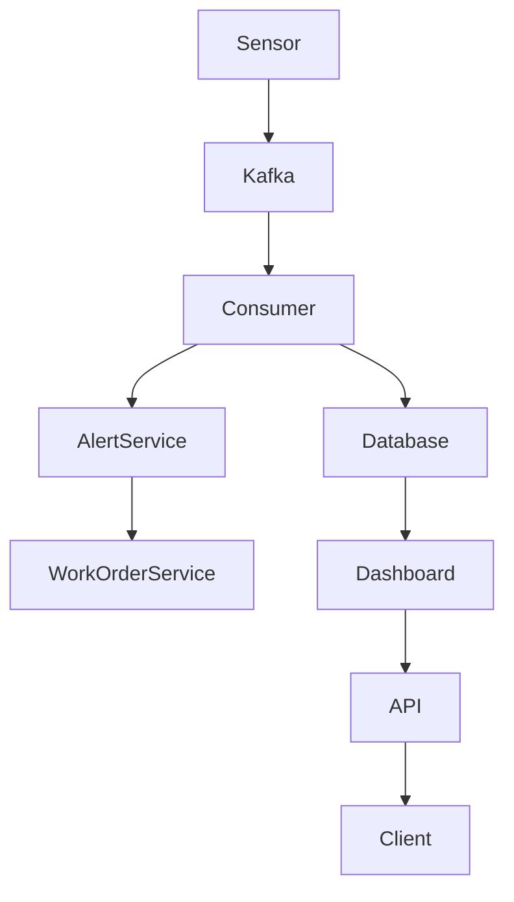
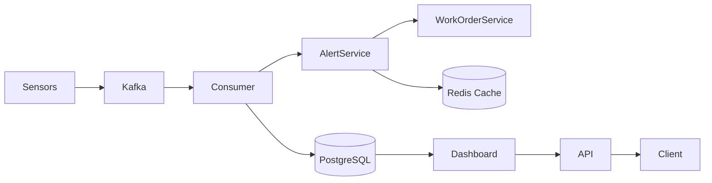
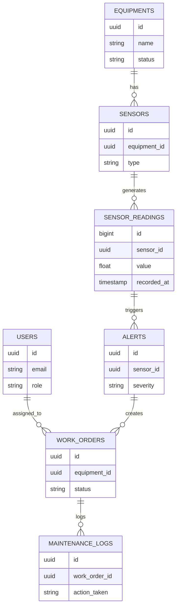

# FaultStream

Industrial Equipment Fault Detection & Management System

---

## Overview

FaultStream is a backend system designed to monitor industrial equipment, detect faults in real time, and automate maintenance workflows.

Many mid-sized factories still rely on manual tracking (Excel, paper, phone calls) for equipment failures. Enterprise solutions like SAP PM or IBM Maximo are expensive and complex.

FaultStream provides a modern, scalable, and cost-effective alternative.

---

## Problem

Industrial environments generate continuous sensor data, but:

- Failures are detected too late  
- Maintenance processes are manual  
- No centralized tracking system exists  
- Enterprise tools are too expensive  

---

## Solution

FaultStream processes sensor data, detects anomalies, and automates maintenance operations.

Core capabilities:

- Real-time fault detection  
- Automatic alert generation  
- Work order creation  
- Maintenance tracking  
- Equipment health monitoring  

---

## Tech Stack

- Java 21  
- Spring Boot 3  
- PostgreSQL  
- Apache Kafka  
- Redis  
- Docker & Docker Compose  
- GitHub Actions  

---

## System Architecture



## System Flow (Detailed)



---

## API Example

### Create Work Order (Auto or Manual)

Request:

```http
POST /api/v1/work-orders
Authorization: Bearer <your_jwt_token>
Content-Type: application/json
```

```json
{
  "equipmentId": "uuid",
  "title": "High temperature detected",
  "description": "Compressor overheating",
  "priority": "HIGH"
}
```

Response:

```json
{
  "id": "uuid",
  "status": "OPEN",
  "priority": "HIGH",
  "created_at": "timestamp"
}
```

---

## Database Schema



---

## Authentication & Authorization

- JWT-based authentication  
- Role-based access control  

Roles:

- ADMIN  
- ENGINEER  
- TECHNICIAN  

---

## Core Domains

### Equipment
Represents industrial machines.

### Sensor
Collects data from equipment.

### Alert
Triggered when thresholds are exceeded.

### Work Order
Created automatically for critical faults.

### Maintenance Log
Stores repair history.

---

## Data Flow

1. Sensors generate data  
2. Data is sent to Kafka  
3. Consumer processes the data  
4. Values are stored in PostgreSQL  
5. Thresholds are evaluated  
6. Alerts are generated  
7. Critical alerts create work orders  
8. Redis caches active alerts  
9. Dashboard retrieves data  

---

## Example Flow

- Sensor reports abnormal value  
- System detects threshold violation  
- Alert is created  
- Work order is automatically generated  
- Technician resolves issue  
- Maintenance log is recorded  

---

## Running the System

```bash
docker-compose up --build
```

Services:

- PostgreSQL  
- Kafka  
- Redis  
- Application  

---

## API Overview

### Auth

POST /api/v1/auth/login  

---

### Equipment

GET /api/v1/equipments  
POST /api/v1/equipments  
GET /api/v1/equipments/{id}/health  

---

### Alerts

GET /api/v1/alerts  
POST /api/v1/alerts/{id}/acknowledge  

---

### Work Orders

GET /api/v1/work-orders  
POST /api/v1/work-orders  
PUT /api/v1/work-orders/{id}/status  

---

## Design Decisions

- Kafka is used for high-throughput sensor data  
- PostgreSQL ensures relational consistency  
- Redis is used for caching active alerts  
- JWT provides stateless authentication  

---

## Status

Work in progress.

Currently implemented:

- User domain  
- JWT authentication  
- Basic project structure  

Planned:

- Sensor data pipeline  
- Alert system  
- Work order automation  
- Dashboard  

---

## Why This Project Matters

This project is not a simple CRUD application.

It represents a real-world system involving:

- event-driven architecture  
- distributed systems  
- real-time processing  

---

## Author

Bedir Avşar  
Backend Developer  
Mechanical Engineering background
