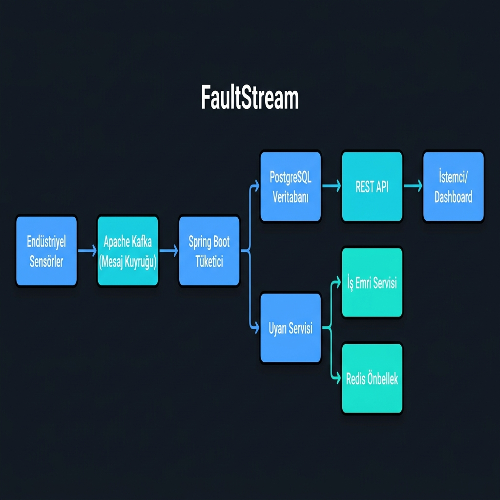
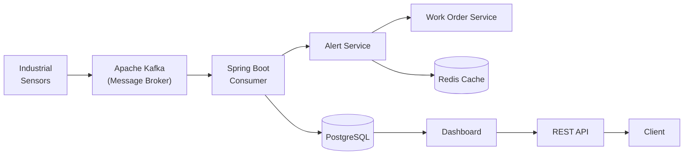
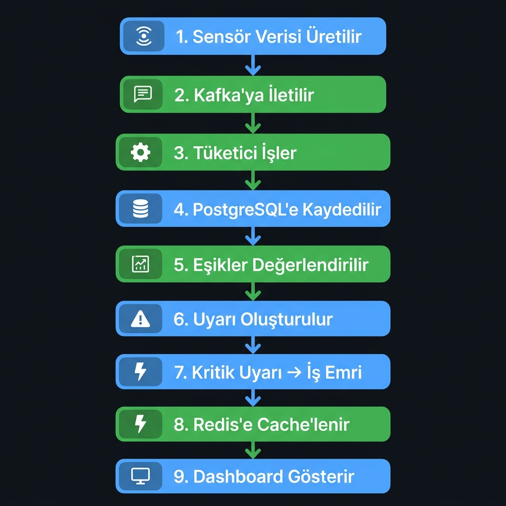
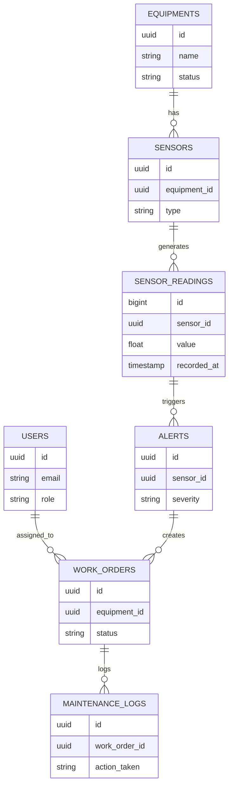

# FaultStream

**Industrial Equipment Fault Detection & Management System**

[](https://www.oracle.com/java/)
[](https://spring.io/projects/spring-boot)
[](https://kafka.apache.org/)
[](https://www.postgresql.org/)
[](https://redis.io/)
[](https://www.docker.com/)
[](LICENSE)

---

## Overview

**FaultStream** is an **event-driven backend system** designed to monitor industrial equipment in real-time, detect anomalies automatically, and orchestrate maintenance workflows.

Many mid-sized manufacturing facilities still manage equipment failures using spreadsheets, paper forms, and phone calls. Enterprise solutions like SAP PM or IBM Maximo are often too complex and expensive for many businesses. FaultStream fills this gap with a modern, scalable, and cost-effective architecture.

---

## The Problem

Industrial environments generate continuous sensor data, but:

- Failures are detected too late → resulting in production downtime and financial loss.
- Maintenance processes are manual → leading to inevitable human error.
- No centralized tracking exists → preventing historical data analysis.
- Enterprise tools are prohibitively expensive → excluding SMEs from advanced monitoring.

---

## The Solution

FaultStream processes sensor data in real-time, evaluates threshold violations, and automates maintenance operations.

**Core Capabilities:**

| Feature | Description |
|---|---|
| Real-time Fault Detection | Sensor data is processed instantly via Kafka streams. |
| Automated Alert Generation | The system generates alerts automatically upon threshold violations. |
| Work Order Orchestration | Critical faults trigger automated work order creation. |
| Maintenance Tracking | All interventions and repairs are logged for auditing. |
| Equipment Health Monitoring | Real-time status tracking for every connected machine. |

---

## Tech Stack

| Layer | Technology | Purpose |
|---|---|---|
| Runtime | Java 21 | Modern concurrency with Project Loom support. |
| Framework | Spring Boot 3.5 | Core REST API, DI, and security infrastructure. |
| Database | PostgreSQL | Relational data consistency and integrity. |
| Message Broker | Apache Kafka | High-throughput ingestion of sensor data streams. |
| Caching | Redis | Low-latency access to active alerts. |
| Migration | Flyway | Version-controlled database schema management. |
| Security | Spring Security + JWT | Stateless authentication and RBAC. |
| Containerization | Docker & Compose | One-command deployment for development. |
| CI/CD | GitHub Actions | Automated build and testing pipeline. |
| Documentation | SpringDoc OpenAPI | Integrated Swagger UI for API exploration. |

---

## System Architecture

The following diagram illustrates the data flow from physical sensors through the various ingestion and processing layers to the end user.



> **Reading Guide:** Sensor data is published to Kafka → Spring Boot consumers process the messages → Data is persisted to PostgreSQL and simultaneously evaluated by the Alert Service. Critical alerts trigger automated Work Orders; active alerts are cached in Redis.

### Detailed Flow (Mermaid)



---

## Data Flow Pipeline

The step-by-step logic of the system is visualized below:



### Steps:

1. **Sensor Data Generation** — Sensors generate real-time readings (temperature, vibration, pressure).
2. **Kafka Ingestion** — Data is sent to a high-performance message queue ensuring zero data loss.
3. **Consumer Processing** — Spring Boot consumers ingest messages and initiate the workflow.
4. **PostgreSQL Persistence** — Normalized sensor readings are stored in the relational database.
5. **Threshold Evaluation** — Each reading is compared against pre-defined safety ranges.
6. **Alert Generation** — Violations trigger alert records with severity levels (LOW to CRITICAL).
7. **Critical Alert → Work Order** — CRITICAL alerts automatically initiate an emergency work order.
8. **Redis Caching** — Active alerts are cached for instant access, reducing dashboard latency.
9. **Dashboard Visualization** — The engineer/technician interface displays the real-time status.

---

## Database Schema

The system utilizes a normalized schema versioned via 7 Flyway migration files.



**Migration Files:**

```
V1__create_users.sql          → User and authentication schema
V2__create_equipments.sql     → Equipment inventory schema
V3__create_sensors.sql        → Sensor metadata schema
V4__create_sensor_readings.sql → Time-series optimized reading records
V5__create_alerts.sql         → Alert and notification schema
V6__create_work_orders.sql    → Work order management schema
V7__create_maintenance_logs.sql → Historical maintenance logging
```

---

## Authentication & Authorization

FaultStream implements a stateless security architecture. Every request is verified via a JWT token, and authorization is enforced based on role claims within the token.

```
User → Login Request → Receives JWT Token → Subsequent Requests with Token → Spring Security Filter → Role Validation → Access Granted/Denied
```

**Roles and Permissions:**

| Role | Description |
|---|---|
| `ADMIN` | Full system access; user management. |
| `ENGINEER` | Management of equipment, sensors, and alert thresholds. |
| `TECHNICIAN` | Viewing and updating assigned work orders. |

---

## Core Domain Models

### Equipment
Represents physical machinery in the factory. Status (`ACTIVE`, `FAULT`, `MAINTENANCE`) is tracked in real-time.

### Sensor
Devices attached to equipment for measurements (e.g., Temperature, Vibration). Each sensor is relationally linked to a specific machine.

### Alert
Automatically generated when a sensor reading exceeds defined thresholds. The severity level (LOW to CRITICAL) dictates the subsequent workflow.

### Work Order
Critical alerts trigger automated work order creation, including assigned technician, priority, and description.

### Maintenance Log
Records details of interventions whenever a work order is completed, enabling historical auditing and reporting.

---

## API Reference

### Authentication

```http
POST /api/v1/auth/register
POST /api/v1/auth/login
```

### Equipment Management

```http
GET    /api/v1/equipments              # List all equipment
POST   /api/v1/equipments              # Create new equipment
GET    /api/v1/equipments/{id}/health  # Equipment health status
```

### Alert Management

```http
GET    /api/v1/alerts                     # List all alerts
POST   /api/v1/alerts/{id}/acknowledge    # Acknowledge an alert
```

### Work Order Management

```http
GET    /api/v1/work-orders                # List work orders
POST   /api/v1/work-orders                # Create manual work order
PUT    /api/v1/work-orders/{id}/status    # Update status
```

---

## Getting Started

**Prerequisites:** Docker, Java 21+

```bash
# Clone the repository
git clone https://github.com/bediravsar/faultStream.git
cd faultStream

# Spin up all services
docker-compose up --build
```

**Services Launched:**
- **PostgreSQL** → `localhost:5432`
- **Apache Kafka** → `localhost:9092`
- **Redis** → `localhost:6379`
- **Application** → `localhost:8080`
- **Swagger UI** → `http://localhost:8080/swagger-ui.html`

---

## Design Decisions

| Decision | Rationale |
|---|---|
| **Apache Kafka** | Traditional REST calls are insufficient for high-frequency sensor streams. Kafka buffers and streams this load efficiently. |
| **PostgreSQL** | Relational integrity is critical for the Equipment → Sensor → Alert → Work Order chain. |
| **Redis** | Querying active alerts frequently from the DB is inefficient; Redis reduces access time to milliseconds. |
| **JWT** | Stateless architecture allows for horizontal scaling without session management overhead. |
| **Flyway** | Schema versioning prevents inconsistencies across development environments and teams. |

---

## Project Status

**Completed:**
- [x] Java 21 + Spring Boot 3 Core Infrastructure
- [x] JWT Authentication and RBAC Integration
- [x] Global Exception Handling and API Standardization
- [x] Full Database Schema (7 Flyway Migrations)
- [x] **New:** Equipment Domain Foundation (Entity, Repository, DTOs)
- [x] Dockerization (PostgreSQL, Kafka, Redis, App)
- [x] OpenAPI/Swagger UI Integration

**In Progress:**
- [ ] Equipment Service and Controller Implementation
- [ ] Kafka Producer/Consumer Implementation

**Planned:**
- [ ] Automated Work Order logic
- [ ] Redis-backed Notification Engine
- [ ] Maintenance History Reporting API
- [ ] Dashboard Visualization API

---

## Contributing

This project is under active development. Contributions, ideas, and feedback are welcome.

- Found a bug? → [Open an Issue](https://github.com/bediravsar/faultStream/issues)
- Want to suggest a feature? → [Start a Discussion](https://github.com/bediravsar/faultStream/discussions)
- Want to contribute? → Fork, branch, and send a PR.

If you find this project useful, don't forget to **⭐ star** it!

---

## Author

**Bedir Avşar**  
Backend Developer | Mechanical Engineer  
[GitHub](https://github.com/bediravsar)

---

> **Keywords:** `java` `spring-boot` `kafka` `event-driven-architecture` `iot` `industrial-iot` `fault-detection` `postgresql` `redis` `docker` `jwt` `flyway` `predictive-maintenance` `manufacturing`
