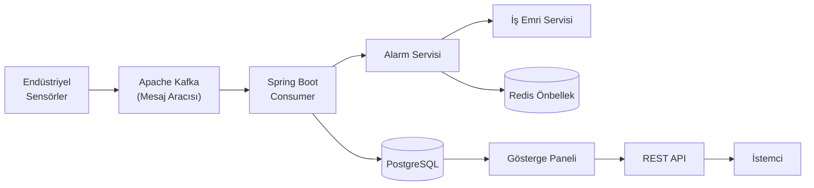
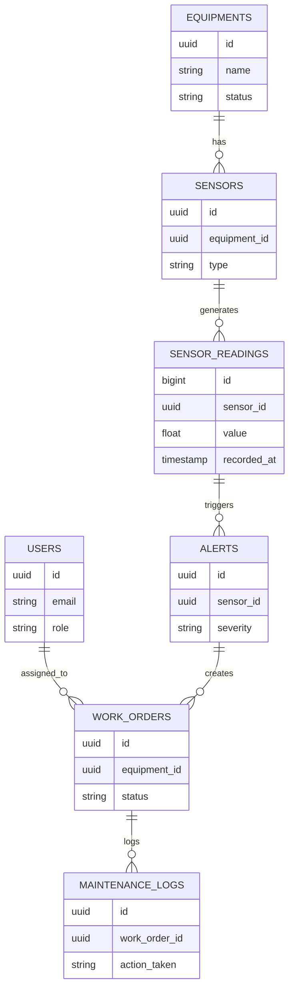

# FaultStream

**Endüstriyel Ekipman Arıza Tespiti ve Yönetim Sistemi**

[](https://www.oracle.com/java/)
[](https://spring.io/projects/spring-boot)
[](https://kafka.apache.org/)
[](https://www.postgresql.org/)
[](https://redis.io/)
[](https://www.docker.com/)
[](LICENSE)

---

## Genel Bakış

**FaultStream**, endüstriyel ekipmanları gerçek zamanlı izlemek, anormallikleri otomatik algılamak ve bakım iş akışlarını yönlendirmek için tasarlanmış **olay güdümlü (event-driven) bir arka uç (backend) sistemidir**.

Birçok orta ölçekli üretim tesisi, ekipman arızalarını halen tablolar (Excel), kağıt formlar ve telefon aramaları ile yönetmektedir. SAP PM veya IBM Maximo gibi kurumsal çözümler, çoğu işletme için genellikle fazla karmaşık ve pahalıdır. FaultStream bu boşluğu modern, ölçeklenebilir ve uygun maliyetli bir mimari ile doldurur.

---

## Problem

Endüstriyel ortamlar sürekli sensör verisi üretir, ancak:

- Arızalar çok geç tespit edilir → üretim kesintisine ve finansal kayıplara yol açar.
- Bakım süreçleri manueldir → kaçınılmaz insan hatalarına neden olur.
- Merkezi bir takip sistemi yoktur → geçmiş veri analizinin yapılmasını engeller.
- Kurumsal araçlar inanılmaz pahalıdır → KOBİ'leri gelişmiş izleme sistemlerinden mahrum bırakır.

---

## Çözüm

FaultStream, sensör verilerini gerçek zamanlı işler, eşik ihlallerini değerlendirir ve bakım operasyonlarını otomatikleştirir.

**Temel Yetenekler:**

| Özellik | Açıklama |
|---|---|
| Gerçek Zamanlı Arıza Tespiti | Sensör verisi Kafka akışları üzerinden anında işlenir. |
| Otomatik Alarm Üretimi | Sistem, eşik ihlallerinde otomatik olarak alarmlar üretir. |
| İş Emri Yönetimi | Kritik arızalar, otomatik iş emri oluşturulmasını tetikler. |
| Bakım Takibi | Tüm müdahaleler ve onarımlar denetim için kaydedilir. |
| Ekipman Sağlık İzlemesi | Bağlı her makine için gerçek zamanlı durum takibi. |

---

## Teknoloji Yığını

| Katman | Teknoloji | Amaç |
|---|---|---|
| Çalışma Zamanı | Java 21 | Project Loom desteği ile modern eşzamanlılık (concurrency). |
| Framework | Spring Boot 3.5 | Temel REST API, Dependency Injection ve güvenlik altyapısı. |
| Veritabanı | PostgreSQL | İlişkisel veri tutarlılığı ve bütünlüğü. |
| Mesaj Aracısı | Apache Kafka | Sensör veri akışlarının yüksek verimle içeri alınması (ingestion). |
| Önbellek | Redis | Aktif alarmlara çok düşük gecikmeli erişim. |
| Göç (Migration) | Flyway | Versiyon kontrollü veritabanı şema yönetimi. |
| Güvenlik | Spring Security + JWT | Durumsuz (stateless) kimlik doğrulama ve RBAC (Rol bazlı erişim). |
| Konteynerizasyon | Docker & Compose | Geliştirme için tek komutla kurulum. |
| CI/CD | GitHub Actions | Otomatik derleme (build) ve test hattı. |
| Dokümantasyon | SpringDoc OpenAPI | API keşfi için entegre Swagger UI. |

---

## Sistem Mimarisi

Aşağıdaki diyagram, fiziksel sensörlerden gelen verinin çeşitli işleme katmanlarından geçerek son kullanıcıya ulaşma sürecini göstermektedir.


> **Okuma Rehberi:** Sensör verisi Kafka'ya yayınlanır → Spring Boot tüketici (consumer) servisleri mesajları işler → Veri PostgreSQL'e kaydedilir ve eş zamanlı olarak Alert Service tarafından değerlendirilir. Kritik alarmlar otomatik İş Emirlerini (Work Orders) tetikler; aktif alarmlar Redis'te önbelleğe (cache) alınır.

### Detaylı Akış (Mermaid)



---

## Veri Akışı İşleyişi (Pipeline)

Sistemin adım adım mantığı aşağıda görselleştirilmiştir:


### Adımlar

1. **Sensör Verisi Üretimi** — Sensörler gerçek zamanlı okumalar üretir (sıcaklık, titreşim, basınç).
2. **Kafka İletimi** — Sıfır veri kaybı sağlamak için veriler yüksek performanslı mesaj kuyruğuna aktarılır.
3. **Consumer İşlemi** — Spring Boot uygulaması mesajları alır ve iş akışını başlatır.
4. **PostgreSQL Kaydı** — Normalize edilmiş sensör okumaları ilişkisel veritabanında saklanır.
5. **Eşik Değerlendirmesi** — Her okuma, önceden tanımlanmış güvenlik aralıklarıyla karşılaştırılır.
6. **Alarm Üretimi** — İhlaller, şiddet seviyelerine (LOW'dan CRITICAL'a kadar) sahip alarm kayıtlarını tetikler.
7. **Kritik Alarm → İş Emri** — CRITICAL alarmlar otomatik olarak bir acil durum iş emri başlatır.
8. **Redis Önbellekleme** — Aktif alarmlar, gösterge paneli gecikmesini (latency) azaltmak için anında erişime hazır tutulur.
9. **Dashboard Görselleştirme** — Mühendis/teknisyen arayüzü gerçek zamanlı durumu görüntüler.

---

## Veritabanı Şeması

Sistem, 7 adet Flyway göç (migration) dosyasıyla versiyonlanan, normalize edilmiş bir şema kullanır.



**Göç (Migration) Dosyaları:**

```
V1__create_users.sql          → Kullanıcı ve yetkilendirme şeması
V2__create_equipments.sql     → Ekipman envanter şeması
V3__create_sensors.sql        → Sensör meta veri şeması
V4__create_sensor_readings.sql → Zaman serisi (Time-series) optimize edilmiş okuma kayıtları
V5__create_alerts.sql         → Alarm ve bildirim şeması
V6__create_work_orders.sql    → İş emri yönetim şeması
V7__create_maintenance_logs.sql → Geçmiş bakım kayıtları
```

---

## Kimlik Doğrulama ve Yetkilendirme

FaultStream durumsuz (stateless) bir güvenlik mimarisi uygular. Her bir istek JWT token üzerinden doğrulanır ve yetkilendirme, token içindeki rollere (claims) dayalı olarak zorunlu kılınır.

```
Kullanıcı → Giriş İsteği → JWT Token Alır → Token ile Sonraki İstekler → Spring Security Filtresi → Rol Doğrulaması → Erişim Verildi/Reddedildi
```

**Roller ve İzinler:**

| Rol | Açıklama |
|---|---|
| `ADMIN` | Sisteme tam erişim; kullanıcı yönetimi yapabilir. |
| `ENGINEER` | Ekipman, sensör ve alarm eşik değerlerini yönetebilir. |
| `TECHNICIAN` | Kendisine atanan iş emirlerini görüntüleyebilir ve güncelleyebilir. |

---

## Temel Domain Modelleri

### Ekipman (Equipment)

Fabrikadaki fiziksel makineleri temsil eder. Durumu (`ACTIVE`, `FAULT`, `MAINTENANCE`) gerçek zamanlı olarak takip edilir.

### Sensör (Sensor)

Ölçümler (örn. Sıcaklık, Titreşim) için makinelerin üzerine yerleştirilen cihazlar. Her sensör spesifik bir makineye ilişkisel olarak bağlıdır.

### Alarm (Alert)

Sensör değerleri, tanımlanmış güvenlik eşiklerini aştığında otomatik olarak oluşturulur. Şiddet seviyesi (LOW ile CRITICAL arası), o andan sonraki iş akışının hızını belirler.

### İş Emri (Work Order)

Kritik seviyedeki alarmlar; atanmış teknisyen, öncelik ve arıza açıklamasını içeren iş emirlerinin sistem tarafından otomatik olarak kurgulanmasını tetikler.

### Bakım Logu (Maintenance Log)

Bir iş emri tamamlandığında müdahalelerin tüm detaylarını işler ve şirket için denetime/raporlamaya uygun bir tarihçe oluşturur.

---

## API Referansı

### Kimlik Doğrulama (Auth)

```http
POST /api/v1/auth/register
POST /api/v1/auth/login
```

### Ekipman Yönetimi

```http
GET    /api/v1/equipments              # Tüm ekipmanları listele
POST   /api/v1/equipments              # Yeni ekipman oluştur
GET    /api/v1/equipments/{id}/health  # Ekipman sağlık durumu
```

### Alarm Yönetimi

```http
GET    /api/v1/alerts                     # Tüm alarmları listele
POST   /api/v1/alerts/{id}/acknowledge    # Alarmı görüldü (acknowledge) olarak işaretle
```

### İş Emri Yönetimi

```http
GET    /api/v1/work-orders                # İş emirlerini listele
POST   /api/v1/work-orders                # Manuel iş emri oluştur
PUT    /api/v1/work-orders/{id}/status    # İş emri durumunu güncelle
```

---

## Başlangıç Kılavuzu (Getting Started)

**Gereksinimler:** Docker, Java 21+

```bash
# Repoyu bilgisayarınıza indirin
git clone https://github.com/bediravsar/faultStream.git
cd faultStream

# Bütün servisleri ayağa kaldırın
docker-compose up --build
```

**Ayağa Kalkan Servisler:**

- **PostgreSQL** → `localhost:5432`
- **Apache Kafka** → `localhost:9092`
- **Redis** → `localhost:6379`
- **Application** → `localhost:8080`
- **Swagger UI** → `http://localhost:8080/swagger-ui.html`

---

## Tasarım Kararları (Design Decisions)

| Karar | Gerekçe |
|---|---|
| **Apache Kafka** | Geleneksel REST istekleri yüksek frekanslı sensör akışları için yeterli değildir. Kafka bu yükü sorunsuz şekilde karşılar ve tamponlar (buffer). |
| **PostgreSQL** | Ekipman → Sensör → Alarm → İş Emri zinciri için katı ilişkisel veri bütünlüğü şarttır. |
| **Redis** | Aktif alarmları sürekli DB'den sorgulamak verimsizdir; Redis bu erişim süresini milisaniyelere düşürür. |
| **JWT** | Durumsuz mimari (Stateless), session yükü getirmeden mikroservislerin veya uygulamaların yatayda ölçeklenmesini sağlar. |
| **Flyway** | Şema versiyonlaması, geliştirme ortamları veya ekipler arası veri tutarsızlığını önler. |

---

## Proje Durumu

**Tamamlananlar:**

- [x] Java 21 + Spring Boot 3 Temel Altyapısı
- [x] JWT Kimlik Doğrulama ve RBAC Entegrasyonu
- [x] Küresel Hata Yakalama (Global Exception) ve API Standardizasyonu
- [x] Tüm Veritabanı Şeması (7 Flyway Migration dosyası)
- [x] **Yeni:** Equipment Domain Altyapısı (Entity, Repository, DTOs)
- [x] Dockerizasyon (PostgreSQL, Kafka, Redis, App)
- [x] OpenAPI/Swagger UI Entegrasyonu

**Devam Edenler:**

- [ ] Equipment Service ve Controller Uygulamaları
- [ ] Kafka Producer/Consumer Kodlamaları

**Planlananlar:**

- [ ] Otomatik İş Emri Mantığı
- [ ] Redis Destekli Bildirim (Notification) Motoru
- [ ] Bakım Geçmişi Raporlama API'si
- [ ] Dashboard Görselleştirme API'si

---

## Katkıda Bulunma

Bu proje aktif geliştirme aşamasındadır. Katkılar, fikirler ve geri bildirimler memnuniyetle karşılanır.

- Bir hata (bug) mı buldunuz? → [Issue Açın](https://github.com/bediravsar/faultStream/issues)
- Bir özellik (feature) mi önermek istiyorsunuz? → [Tartışma Başlatın](https://github.com/bediravsar/faultStream/discussions)
- Katkıda mı bulunacaksınız? → Fork'layın, branch oluşturun ve PR gönderin.

Bu projeyi faydalı bulduysanız, lütfen **⭐ yıldız (star)** vermeyi unutmayın!

---

## Geliştirici

**Bedir Avşar**  
Backend Developer | Makine Mühendisi  
[GitHub](https://github.com/bediravsar)

---

> **Anahtar Kelimeler (Keywords):** `java` `spring-boot` `kafka` `olay-güdümlü-mimari` `iot` `endüstriyel-iot` `arıza-tespiti` `postgresql` `redis` `docker` `jwt` `flyway` `kestirimci-bakım` `üretim`
